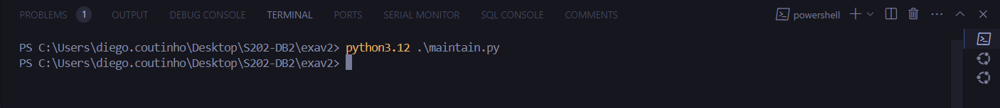
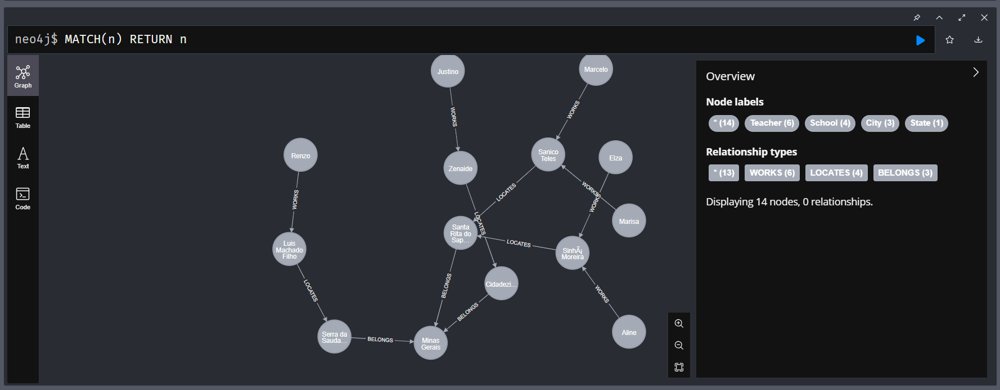
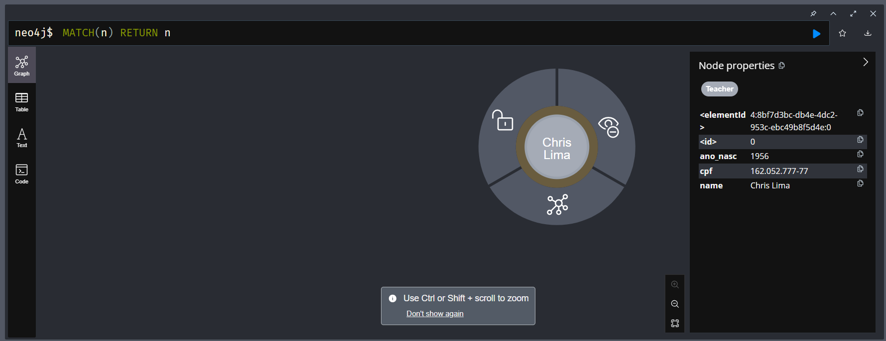

# Exercício avaliativo 2 - Neo4j 
Neo4j em ambiente local virtualizado com **Docker**.  
Container executado com comando **```docker compose up --build -d```** no arquivo `docker-compose.yml`.

## Carregando dados:
[maintain.py](/exav2/maintain.py) é utilizado para limpar todos os dados antigos do banco de dados Neo4j e carregar novos dados a partir de um arquivo `mock.data.txt`. 



- Após a execução do script, os dados podem ser verificados no Neo4j Browser, conforme mostrado na imagem `image-1.png`.



## Execução do Script 

Abaixo estão os passos e os resultados esperados para cada questão abordada no script.

#### Passos para Execução:

1. **Certifique-se de que o Neo4j está em execução.**
2. **Execute o script**  utilizando o comando:
   ```sh
   python3.12 main.py
   ```

#### Resultados Esperados:

1. **Questão 1 - A**:
   - Consulta um professor pelo nome "Renzo".
   - Resultado: `<Record t.ano_nasc=1956 t.cpf='789.012.345-67'>`

2. **Questão 1 - B**:
   - Consulta professores cujos nomes começam com "M".
   - Resultado: 
     ```plaintext
     [<Record t.name='Marisa' t.cpf='012.345.678-91'>,
      <Record t.name='Marcelo' t.cpf='890.123.456-78'>]
     ```

3. **Questão 1 - C**:
   - Consulta todos os nomes de cidades.
   - Resultado: 
     ```plaintext
     [<Record c.name='Santa Rita do Sapucaí'>,
      <Record c.name='Serra da Saudade'>,
      <Record c.name='Cidadezinha'>]
     ```

4. **Questão 1 - D**:
   - Consulta escolas com número entre 150 e 550.
   - Resultado: 
     ```plaintext
     [<Record s.name='Sanico Teles' s.address='R. Olavo Marques' s.number=181>,
      <Record s.name='Sinhá Moreira' s.address='Av. Dr. Delfim Moreira' s.number=509>,
      <Record s.name='Zenaide' s.address='Conj. Hab. Gilberto Rossetti' s.number=332>]
     ```

5. **Questão 2 - A**:
   - Consulta o professor mais velho e o mais jovem.
   - Resultado: 
     ```plaintext
     {'oldest': <Record t.ano_nasc=1950>, 'youngest': <Record t.ano_nasc=1998>}
     ```

6. **Questão 2 - B**:
   - Consulta a média da população das cidades.
   - Resultado: `<Record avg(c.population)=37836.333333333336>`

7. **Questão 2 - C**:
   - Substitui todas as letras 'a' por 'A' no nome da cidade com CEP "37540-000".
   - Resultado: `<Record replace(c.name, 'a', 'A')='SAntA RitA do SApucaí'>`

8. **Questão 2 - D**:
   - Consulta o terceiro caractere do nome de todos os professores.
   - Resultado: 
     ```plaintext
     [<Record substring(t.name, 3, 1)='n'>,
      <Record substring(t.name, 3, 1)='i'>,
      <Record substring(t.name, 3, 1)='a'>,
      <Record substring(t.name, 3, 1)='c'>,
      <Record substring(t.name, 3, 1)='z'>,
      <Record substring(t.name, 3, 1)='t'>]
     ```

9. **Questão 3 - B**:
   - Cria um novo professor "Chris Lima".
   - Resultado: `'Created Teacher Chris Lima'`
   - Consulta o professor "Chris Lima".
   - Resultado: `<Record t.ano_nasc=1956 t.cpf='189.052.396-66'>`

10. **Questão 3 - C**:
    - Consulta o professor "Chris Lima".
    - Resultado: `'Teacher Chris Lima'`
    - Resultado: `<Record t.ano_nasc=1956 t.cpf='189.052.396-66'>`

11. **Questão 3 - D**:
    - Atualiza o CPF do professor "Chris Lima".
    - Resultado: `'Updated Teacher Chris Lima'`
    - Consulta o professor "Chris Lima".
    - Resultado: `<Record t.ano_nasc=1956 t.cpf='162.052.777-77'>`

