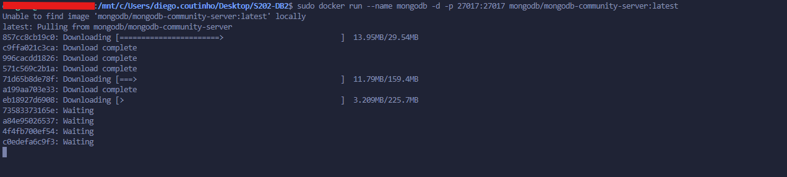
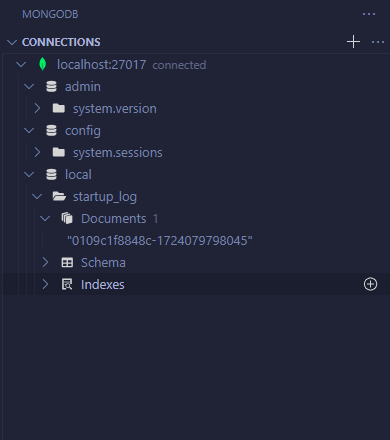
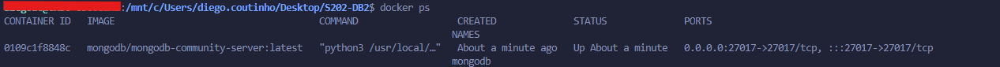
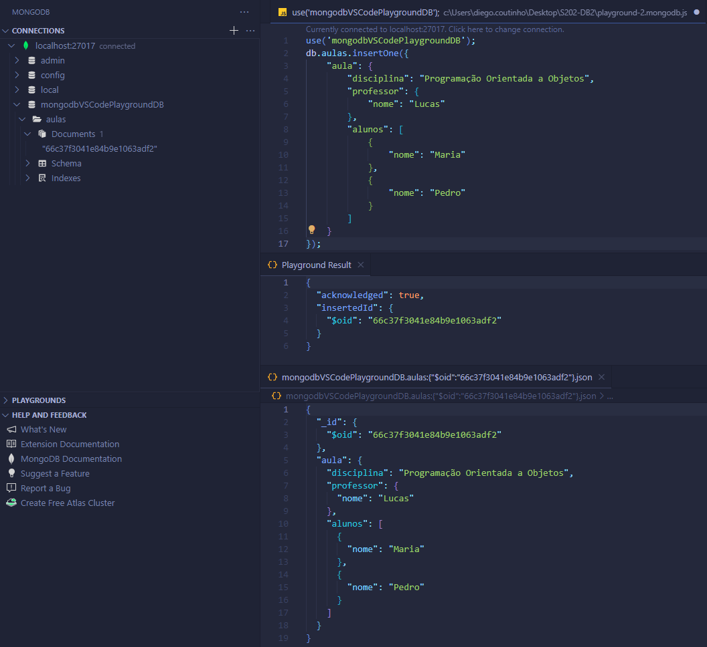

## Relatório 2 - MongoDB
> MongoDB Community Server, Docker Container e extensão MongoDB for VS Code

Em vez de instalar o container no ambiente local e utilizar o software Compass para interação com o banco de dados, optou-se pela instalação e execução do MongoDB Community como Container no ambiente Docker. A extensão MongoDB for VS Code foi utilizada para interação e visualização dos documentos e estruturas do banco de dados.

O comando `docker run --name mongodb -d -p 27017:27017 mongodb/mongodb-community-server:latest` foi utilizado para baixar e executar o container com a imagem do MongoDB Community Server.  


Uma vez em execução, exposto na porta 27017 para conexão com a extensão com `mongodb://localhost:27017`, o container pode ser acessado de maneira semelhante ao ambiente local.  
<p align="center">
  
  
</p>

# Exercício:
Conforme solicitado, um documento JSON equivalente ao exemplo da aula 1 foi elaborado para ser inserido no banco de dados. A seguir, são apresentados os exemplos de execução da query de inserção, o resultado da operação e a visualização do documento no banco de dados.
  
  
**Query de inserção:**
```json
use('mongodbVSCodePlaygroundDB');
db.aulas.insertOne({
  "aula": {
    "disciplina": "Programação Orientada a Objetos",
    "professor": {
      "nome": "Lucas"
    },
    "alunos": [
      {
        "nome": "Maria"
      },
      {
        "nome": "Pedro"
      }
    ]
  }
});
```

**Resultado da operação:**
```json
{
  "acknowledged": true,
  "insertedId": {
    "$oid": "66c37f3041e84b9e1063adf2"
  }
}
```

**Documento no banco de dados:**
```json
{
  "_id": {
    "$oid": "66c37f3041e84b9e1063adf2"
  },
  "aula": {
    "disciplina": "Programação Orientada a Objetos",
    "professor": {
      "nome": "Lucas"
    },
    "alunos": [
      {
        "nome": "Maria"
      },
      {
        "nome": "Pedro"
      }
    ]
  }
}
```