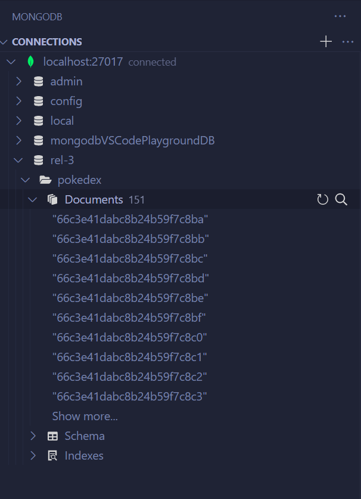

## Relatório 3 - MongoDB em python
> MongoDB Community Server, Docker Container, Python API

Conforme implementado no último relatório, o banco de dados MongoDB Community Server foi instalado e executado em um contêiner Docker. O acesso é realizado através do endereço `mongodb://localhost:27017`, utilizando a extensão MongoDB for VS Code para visualização dos dados e um script Python para execução da lógica.
  

### Estrutura de Arquivos:
* `data.py`: Contém dados estáticos descritos para alocação no banco de dados durante a inicialização.
* `database.py`: Baseado no script fornecido na aula, provê funções de conexão e geração de logs em arquivo.
* `pokedex.py`: Implementa a classe conforme especificado.
* `main.py`: Script principal para execução, incluindo casos de teste, criação de objetos e execução das funções da classe.
* `./logs/*`: Armazena os resultados da execução dos códigos.

# Exercício:
Primeiro, o banco de dados é instanciado com:
```py
database = Database("rel-3", "pokedex") 
database.resetDatabase()
```
Em seguida, um objeto da classe Pokedex é criado e as cinco funções solicitadas são executadas.
```py
pokedex = Pokedex(database)

pidgeotto = pokedex.get("Pidgeotto")
heavyPokemons = pokedex.getByWeightRange(100, 200)
allweakagainst = pokedex.getAllWeakAgainst(pidgeotto[0]["name"])
allstrongagainst = pokedex.getAllStrongAgainst(pidgeotto[0]["name"])
imageUrl = pokedex.getImageUrl("Caterpie")

pokemonImage = requests.get(imageUrl).content
with open(f"./logs/imageFrom_Caterpie.png", "wb") as image:
    image.write(pokemonImage)
```

Logs são gerados para todas as funções executadas na pasta `./logs/*`, conforme descrito abaixo:  
- `Caterpie.json`: Resultado da função `pokedex.get("Pidgeotto")`
- `weightRange_100_200.json`: Resultado da função `pokedex.getByWeightRange(100, 200)`
- `weakAgainst_Pidgeotto.json`: Resultado da função `pokedex.getAllWeakAgainst(pidgeotto[0]["name"])`
- `strongAgainst_Pidgeotto.json`: Resultado da função `pokedex.getAllStrongAgainst(pidgeotto[0]["name"])`
- `imageFrom_Caterpie.png`: Resultado da função `pokedex.getImageUrl("Caterpie")` e requisição GET