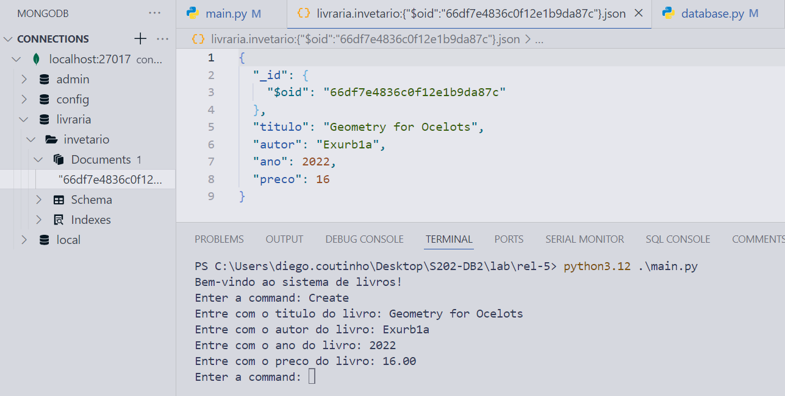
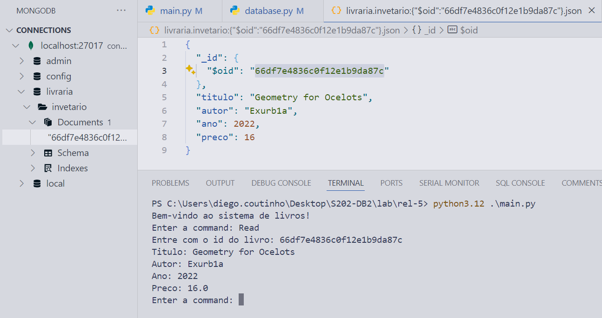
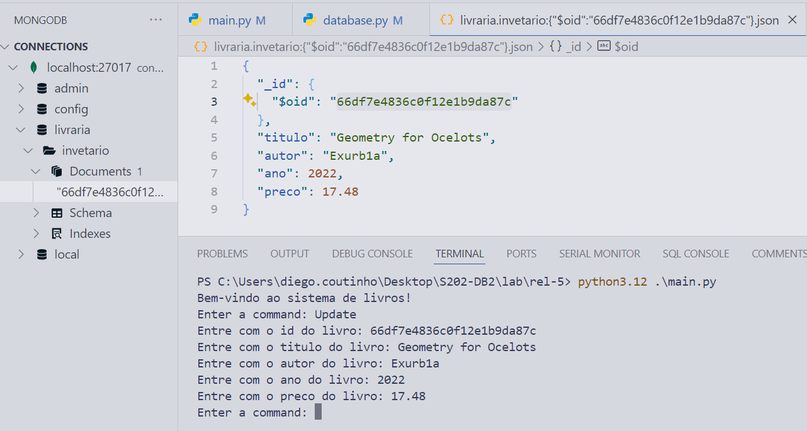
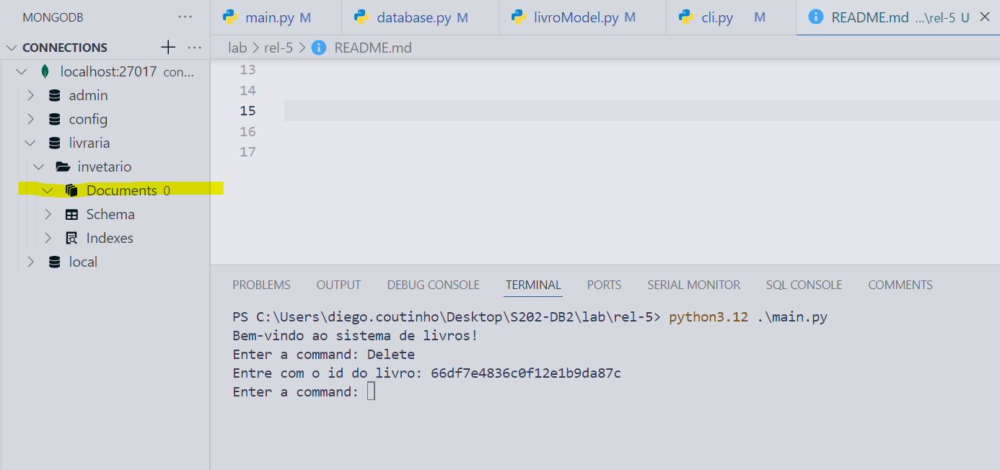

## Relatório 5 - CRUD com MongoDB e python
> MongoDB Community Server, Docker Container, Python API

# Exercício:
A implementação CRUD solicitada foi criada. Os testes manuais realizados estão descritos abaixo.

### Create

### Read

### Update

### Delete

