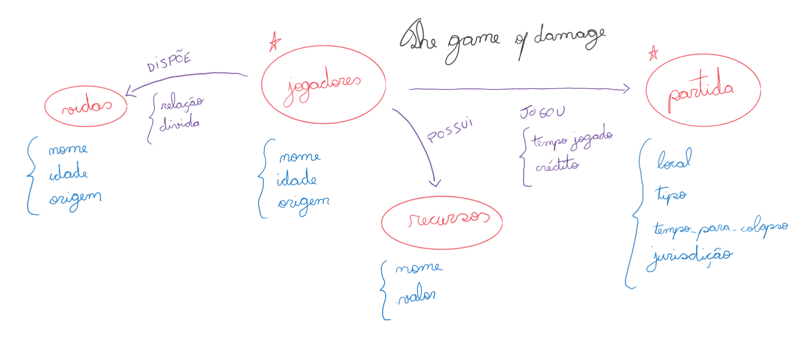
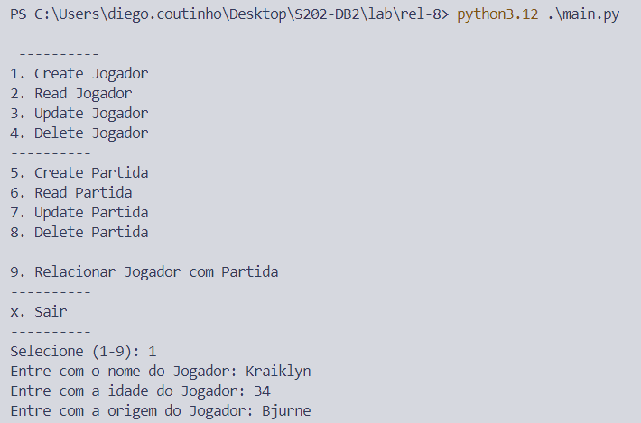
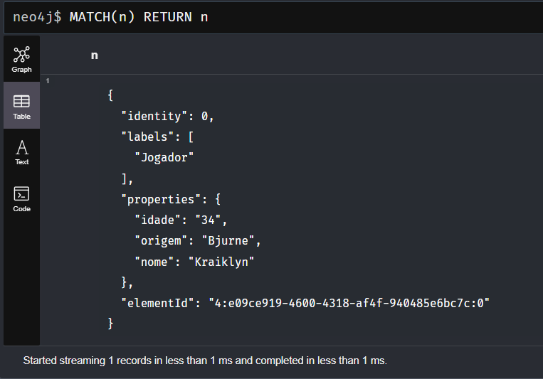
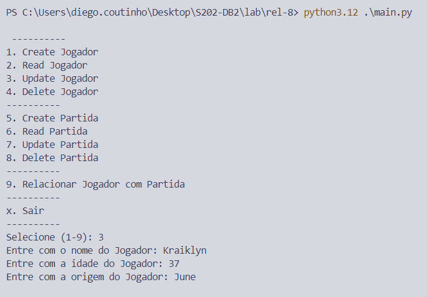
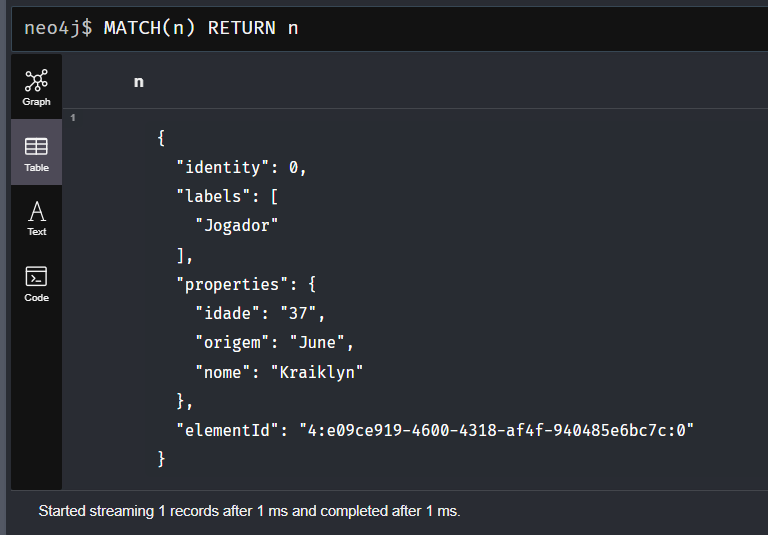
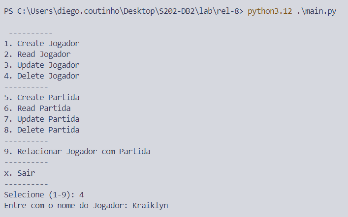
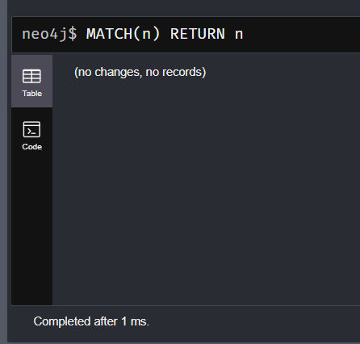
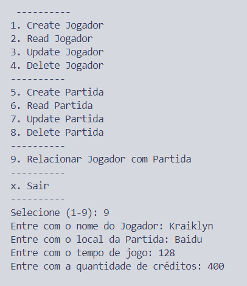
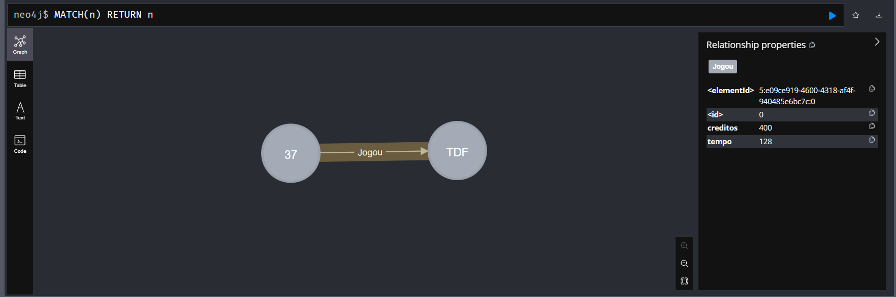

### CURIOSIDADE SOBRE O JOGO DAMAGE:

O jogo "Damage", idealizado na série de livros "The Culture" de Iain M. Banks, ocorre a cada alguns anos em uma localização prestes a ser destruída (um planeta em colapso ou uma estação prestes a sair de órbita), onde nenhuma autoridade ousaria se aproximar.

É um jogo baseado em Poker, onde os jogadores depositam seus recursos (financeiros, políticos, militares, etc.) para entrar no jogo, e o vencedor leva tudo. A cada rodada, o jogador pode apostar sua própria vida ou até 4 outras vidas associadas a ele. O vencedor da rodada permanece intacto, e os perdedores têm suas vidas apostadas retiradas do jogo (💀).

O interessante é que todos os jogadores têm suas mentes conectadas, e seus pensamentos e sentimentos podem ser acessados durante o jogo, tornando quase impossível blefar. Além de acessar as mentes para ler pensamentos ou experienciar emoções, os jogadores podem desferir ataques psicológicos, como medo, raiva ou até mesmo amor, para tentar desestabilizar seus oponentes.

A figura abaixo representa a estrutura relacional entre vidas, jogadores, recursos e partidas, discriminando quais dados são armazenados em cada nó ou relacionamento do banco de dados Neo4j.

**Os itens **Vidas** e **Recursos** não serão modelados para facilitar a implementação do exemplo.**

O B.D. Neo4J do projeto foi inicializado em ambiente Docker com o comando `docker run --name neo4j -d -p 7474:7474 -p 7687:7687 neo4j` e configurado no primeiro acesso para `user: neo4j`, `password: 1234567890`.

# Validação:
## Create do jogador

## Get do jogador

## Update do jogador

## Delete do jogador

**A classe `Partida` essencialmente faz a mesma coisa, os exemplos não serão mostrados.**

## Relacionamento entre jogador e partida

